

  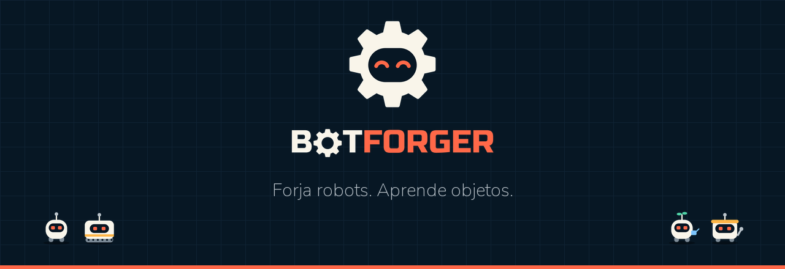

<h3 align="center">Forja robots. Aprende objetos.</h3>

  Un juego de puzles para móvil donde aprendes <b>programación orientada a objetos</b> 
  diseñando planos, forjando robots y salvando una ciudad que se apaga.

  

  
  
  
  
  

---

## La historia

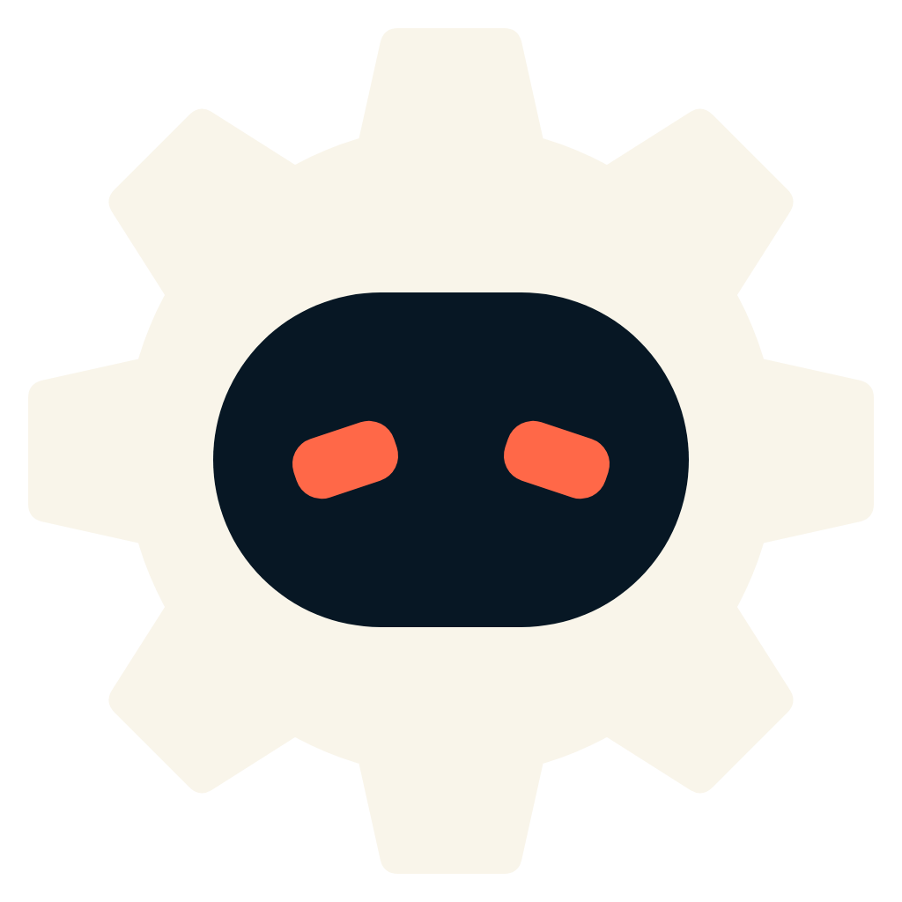

**Ferrópolis se apaga noche a noche.**

La Ingeniera Vega, creadora de la Forja, ha desaparecido. En su lugar se extiende **Ø, la Clase Nula**: una clase sin padre que deja a los robots huecos, sin estado, sin nada que recordar.

Solo queda **FORGI**, el pequeño engranaje que Vega dejó encendido. Contigo como ingeniero, tendrá que diseñar planos, forjar robots y programarlos para devolver la luz a la ciudad… y descubrir qué le pasó a Vega.

> *«No se destruye una clase: se le da un padre.»*

 

## Cómo se juega

  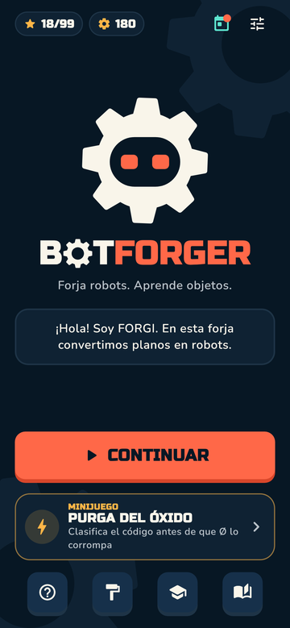
  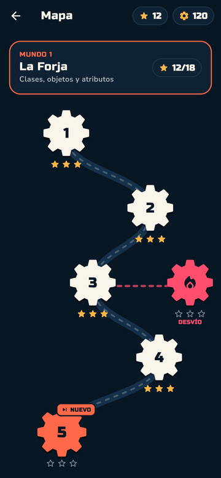
  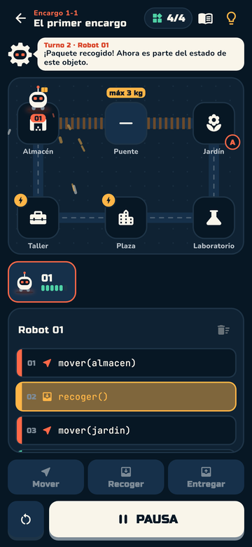
  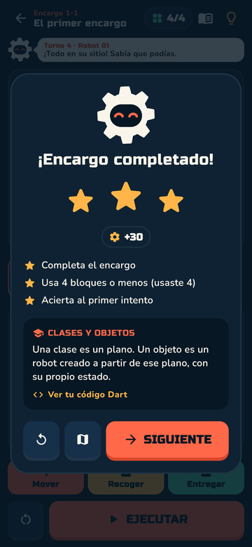

1. **Lee el encargo.** Paquetes que repartir, plantas que regar, máquinas que reparar.
2. **Forja tus robots** a partir de planos. Cada plano es una *clase*; cada robot, un *objeto* con su propia batería y carga.
3. **Prográmalos** tocando el mapa y los bloques. Cada bloque es una línea de código real.
4. **Ejecuta** y mira a tu equipo trabajar turno a turno. ¿Falló? Ajusta y vuelve a intentarlo.
5. **Gana estrellas** por resolverlo, por usar pocos bloques y por superar el reto de cada nivel.

## Lo que aprendes sin darte cuenta

| | Concepto | En la Forja |
| :---: | --- | --- |
| 📐 | **Clase** | Los planos: `RobotLigero`, `RobotCarga`, `Jardinero`… |
| 🤖 | **Objeto** | Cada robot forjado, con su propio estado |
| 🎛️ | **Atributo** | Capacidad, peso y batería de cada robot |
| ▶️ | **Método** | `mover()`, `recoger()`, `entregar()`: cada orden que das |
| 🔒 | **Encapsulación** | La batería es privada: Ø no puede tocarla |
| 🌳 | **Herencia** | El Jardinero hereda de Robot y aprende a regar. ¡Y puedes crear tus propias subclases! |
| ✨ | **Polimorfismo** | Una sola orden, `trabajar()`, y cada robot responde a su manera |
| 🔁 | **Bucles y condiciones** | `repetir(4) { … }` y `si (puedeRecoger())`: programas cortos que piensan |
| 🛩️ | **Interfaces** | `implements Volador`: un contrato que cualquier clase puede firmar para cruzar la niebla |
| 🧩 | **Composición** | Módulos que se acoplan a un robot: Grúa, Regadera, Llave… el robot *tiene* una pieza |
| 🏗️ | **Constructores y sobrecarga** | `RobotLigero(capacidad, inicio)`: decides dónde nace cada objeto |

  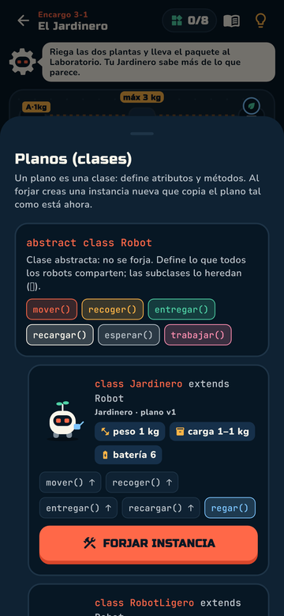
  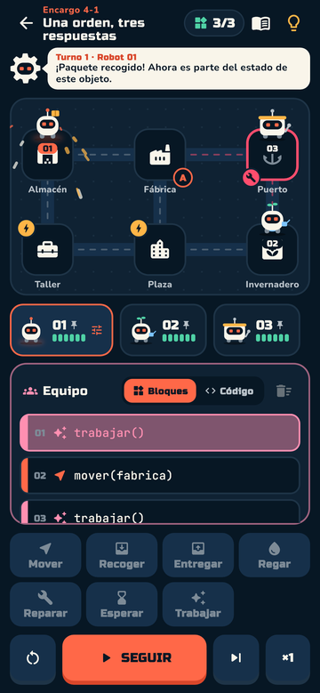
  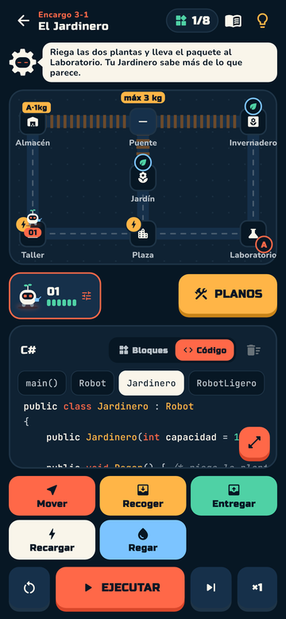
  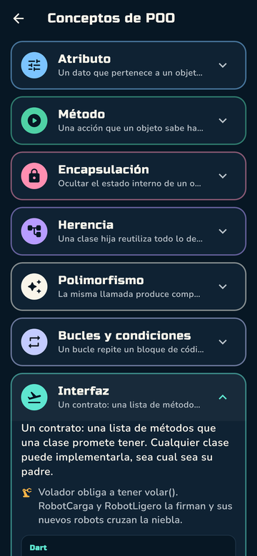

## Novedades de la versión 0.3

  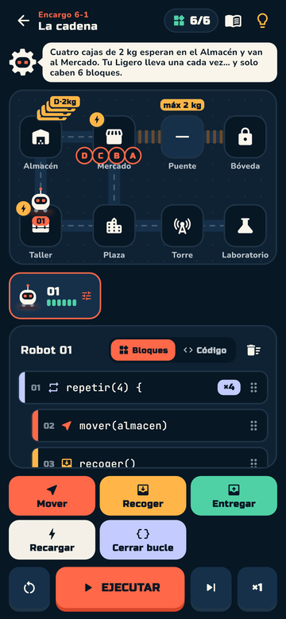
  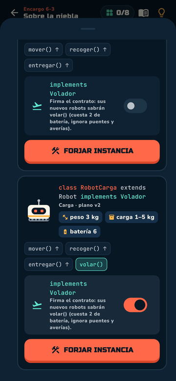
  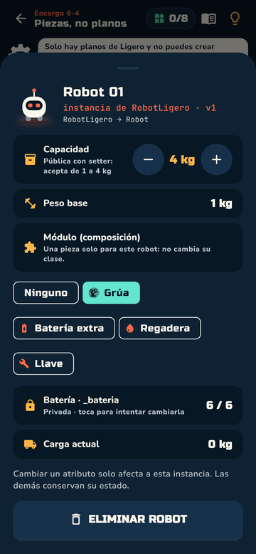
  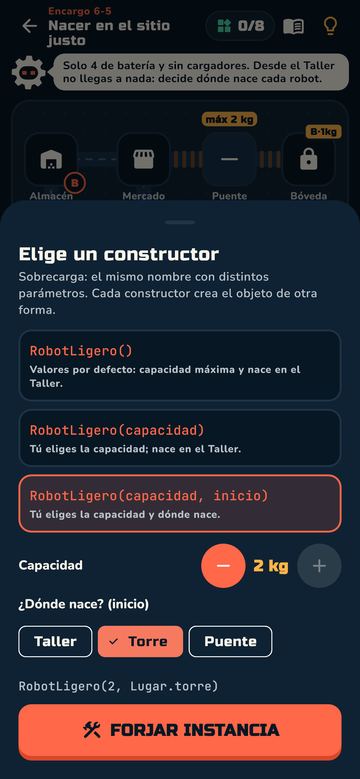

🌆 **Mundo 6 · La Ciudad Alta**: seis encargos nuevos con bucles, condiciones, interfaces, composición y constructores, y el desenlace de la historia. 
📅 **Reto diario**: un encargo nuevo cada día, con racha de días seguidos y un recordatorio en el móvil si aún no lo has hecho. 
🌍 **Portugués y francés**, además de español e inglés. 
🎬 **Créditos finales** y transiciones nuevas entre pantallas.

  
  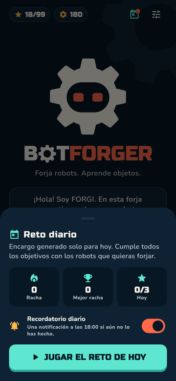
  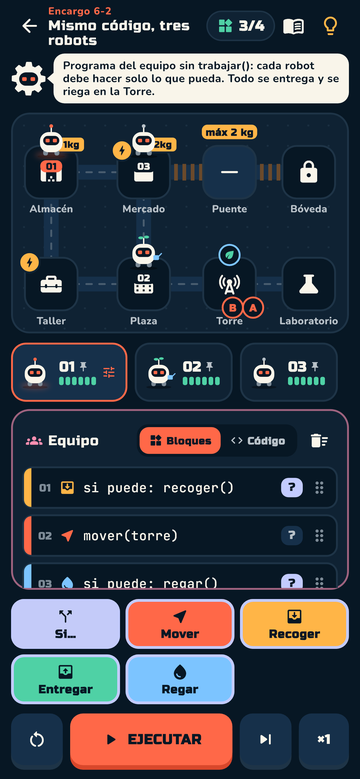
  

## Qué incluye

🗺️ **6 mundos y 33 encargos**, de lo más básico a equipos de robots que trabajan a la vez. 
📅 **Reto diario** con racha y recordatorio. 
🔥 **Desvíos opcionales**: niveles más difíciles que esconden fragmentos de la historia. 
💻 **Tu lenguaje favorito**: ve tu código en **Dart, Python, Java, JavaScript o C#**. 
📖 **Una historia oscura** contada en escenas, que puedes releer en el **Archivo de Vega**. 
⚡ **Purga del Óxido**: minijuego arcade de clasificar código antes de que Ø lo corrompa, con modo Experto. 
🎓 **Conceptos de POO**: cada idea explicada con un ejemplo en tu lenguaje. 
🎨 **Taller de robots**: pinturas y accesorios (chistera, corona, cuernos de Ø…) que heredan todos los robots de una clase. 
💡 **Pistas por niveles** para no quedarte nunca atascado. 
🎵 **Música y efectos propios**, con vibración. 
📱 **Se adapta a tu pantalla**: móviles pequeños y grandes, en horizontal y en tablets.

  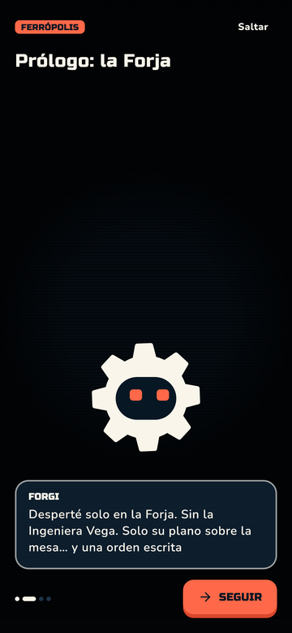
  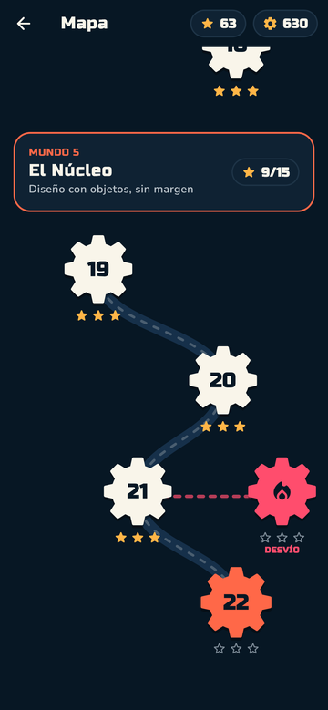
  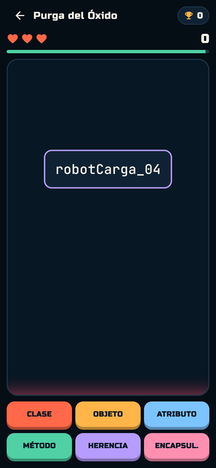
  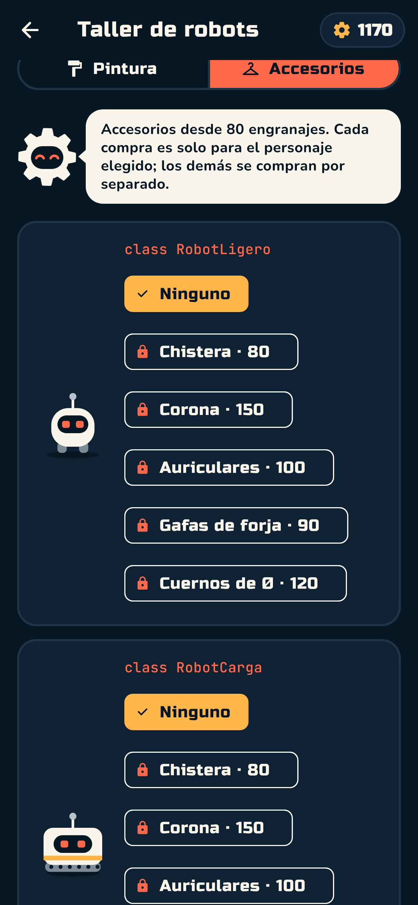

## Descargar e instalar

Ve a **[Releases](https://github.com/AndyCG03/BotForger-Game/releases/latest)** y descarga uno de estos archivos:

| Archivo | Para quién | Tamaño |
| --- | --- | --- |
| **`BotForger-v0.3.0.apk`** | **Si no sabes cuál elegir.** Funciona en cualquier móvil Android | ~56 MB |
| `BotForger-v0.3.0-arm64-v8a.apk` | Móviles modernos (la mayoría desde 2017) | ~22 MB |
| `BotForger-v0.3.0-armeabi-v7a.apk` | Móviles antiguos o de gama baja | ~20 MB |
| `BotForger-v0.3.0-x86_64.apk` | Emuladores y algunos equipos con procesador Intel | ~24 MB |

**Cómo instalarlo:**

1. Descarga el APK desde el móvil.
2. Ábrelo. Si Android lo pide, permite **instalar aplicaciones desconocidas** para tu navegador o gestor de archivos.
3. Pulsa **Instalar** y ¡a forjar!

> [!NOTE]
> Requiere **Android 7.0 o superior**. Si ya tienes la 0.2, instala la 0.3 encima: conservas tu progreso. La primera vez te pedirá permiso para enviarte el recordatorio del reto diario (puedes desactivarlo cuando quieras).
>
>  Es una versión de prueba firmada fuera de Google Play: cuando llegue a la tienda, puede que haya que desinstalar esta versión antes de instalar la oficial (el progreso se guarda en el móvil).

## Próximamente

- 🏆 Logros
- 🛠️ Editor de niveles para retar a tus amigos
- ☁️ Guardado en la nube
- 🛒 Google Play

## Autor

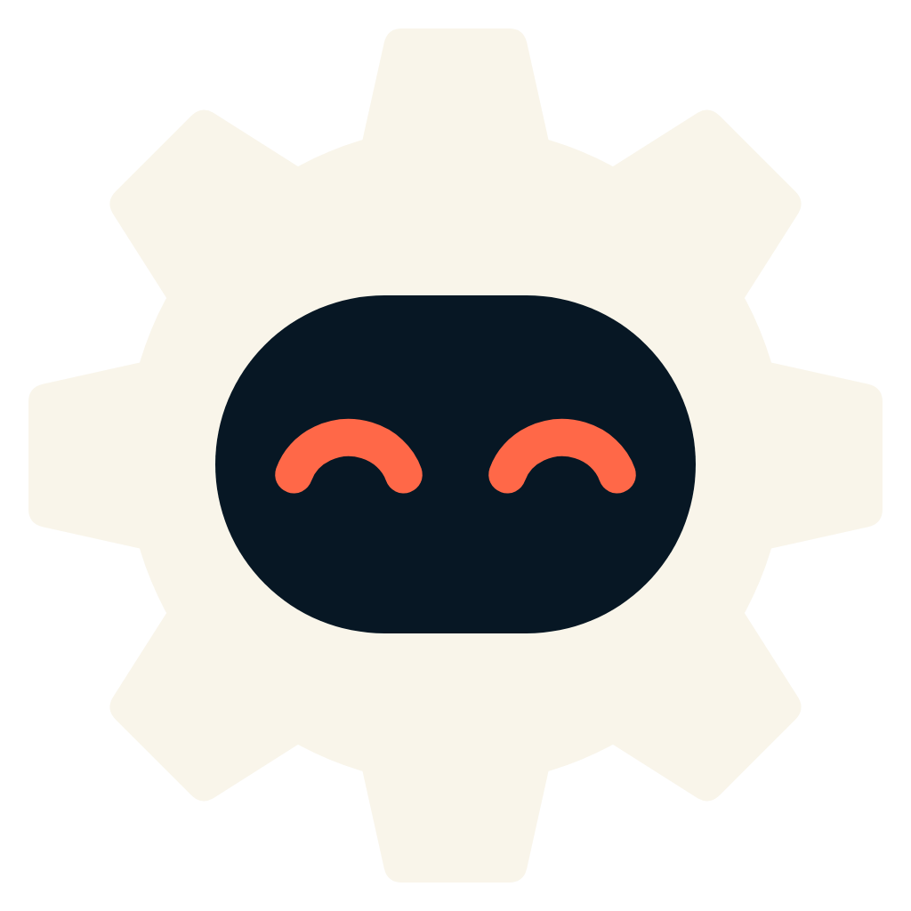

**Ing. Andy Clemente** · diseño y desarrollo 
GitHub: [@AndyCG03](https://github.com/AndyCG03)

¿Ideas, errores o sugerencias? Abre un [issue](https://github.com/AndyCG03/BotForger-Game/issues).

 

---

© 2026 Andy Clemente. Todos los derechos reservados.

